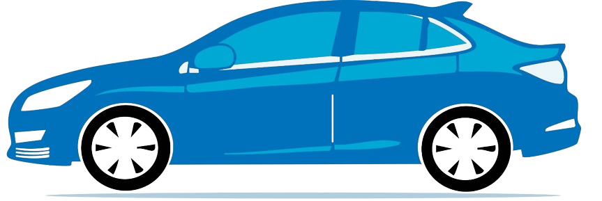

# VíaCar - Sistema de Alquiler de Vehículos

VíaCar es una aplicación web moderna para la gestión de alquiler de vehículos, desarrollada con Laravel, Inertia.js y Vue.js. El sistema permite a los usuarios explorar vehículos disponibles, realizar reservaciones y recibir confirmaciones por correo electrónico.



## Características

- 🚗 Catálogo de vehículos con imágenes y detalles
- 📅 Sistema de reservaciones con selección de fechas
- 📧 Confirmaciones automáticas por correo electrónico
- 👤 Gestión de usuarios y perfiles
- 🔐 Panel de administración para gestionar vehículos y reservas
- 📱 Diseño responsivo para dispositivos móviles y de escritorio

## Tecnologías Utilizadas

- **Backend**: Laravel 10
- **Frontend**: Vue.js 3 con Inertia.js
- **UI Framework**: Vuetify 3
- **Base de Datos**: MySQL
- **Autenticación**: Laravel Breeze

## Requisitos Previos

- PHP >= 8.1
- Composer
- Node.js >= 16.x
- MySQL o MariaDB
- Servidor de correo SMTP (para envío de confirmaciones)

## Instalación

### 1. Clonar el repositorio

```bash
git clone https://github.com/tu-usuario/viacar.git
cd viacar
```

### 2. Instalar dependencias de PHP

```bash
composer install
```

### 3. Instalar dependencias de JavaScript

```bash
npm install
```

### 4. Configurar el entorno
Copia el archivo de ejemplo .env.example a .env y configura tus variables de entorno:
``` bash
copy .env.example .env
```
Genera una clave de aplicación:
``` bash
php artisan key:generate
```

### 5. Configurar la base de datos
Edita el archivo .env con tus credenciales de base de datos:
```bash
DB_CONNECTION=mysql
DB_HOST=127.0.0.1
DB_PORT=3306
DB_DATABASE=viacar
DB_USERNAME=root
DB_PASSWORD=
```

### 6. Configurar el correo electrónico
Configura las variables de entorno para el envío de correos:
```bash
MAIL_MAILER=smtp
MAIL_HOST=smtp.gmail.com
MAIL_PORT=587
MAIL_USERNAME=tu_correo@gmail.com
MAIL_PASSWORD=tu_contraseña_o_app_password
MAIL_ENCRYPTION=tls
MAIL_FROM_ADDRESS=tu_correo@gmail.com
MAIL_FROM_NAME="${APP_NAME}"
```

### 7. Ejecutar migraciones
```bash
php artisan migrate
```

### 8. Compilar assets
```bash
npm run dev
```
Para producción, usa:
```bash
npm run build
```

### 9. Inicioar el servidor
```bash
php artisan serve
```

## Contribución

¡Estamos abiertos a contribuciones! Si deseas mejorar VíaCar, no dudes en enviar tus pull requests:

1. Haz un fork del repositorio
2. Crea una rama para tu característica (`git checkout -b feature/amazing-feature`)
3. Haz commit de tus cambios (`git commit -m 'Add some amazing feature'`)
4. Haz push a la rama (`git push origin feature/amazing-feature`)
5. Abre un Pull Request

Revisaremos todas las contribuciones y estaremos encantados de incorporar mejoras que beneficien al proyecto. Para cambios importantes, por favor abre primero un issue para discutir lo que te gustaría cambiar.


